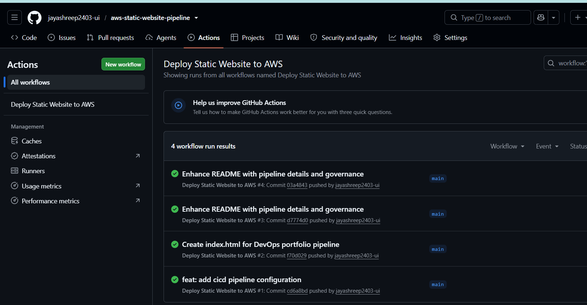
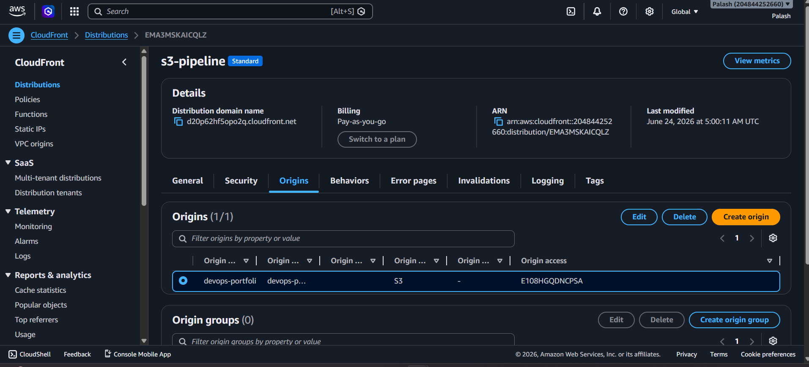
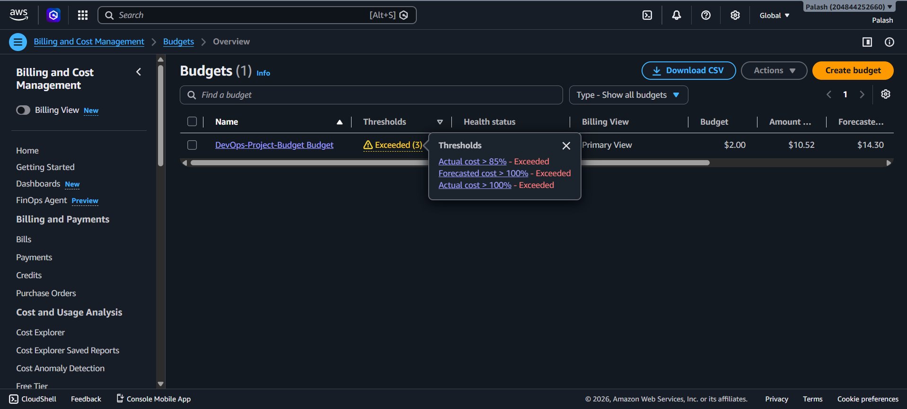
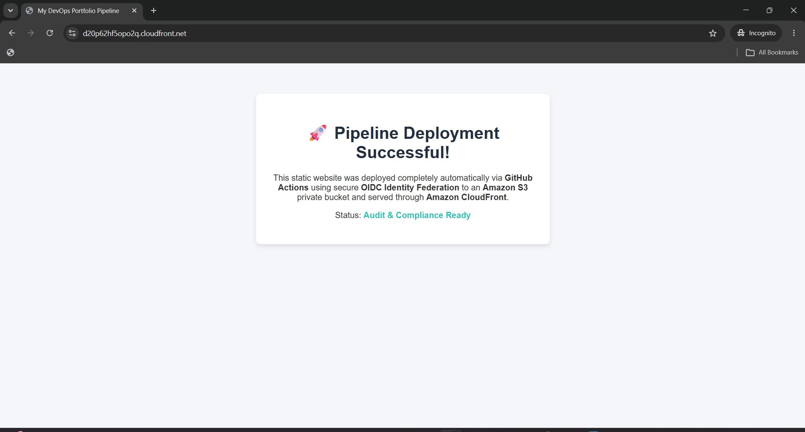

# Automated Static Website Delivery Pipeline with OIDC Governance

A production-grade, audit-ready automated deployment pipeline hosting a high-performance static web application on AWS. This architecture replaces legacy administrative shortcuts with enterprise cloud governance patterns, strictly enforcing zero-permanent-credentials and boundary-isolated storage rules.

---

##  Technical Architecture Overview

The system architecture prioritizes high availability, tight security access boundaries, and near-zero operational overhead. 

*   **Hosting Layer:** Isolated **Amazon S3** object store with default public access explicitly blocked.
*   **Edge Delivery Network:** **Amazon CloudFront** utilizing global caching mechanisms to deliver low-latency assets via HTTPS.
*   **Security Access Boundary:** **Origin Access Control (OAC)** cryptographically restricting the S3 bucket to service requests originating *exclusively* from our specific CloudFront distribution.
*   **Automation Engine:** **GitHub Actions** workflows utilizing **OpenID Connect (OIDC)** identity federation to assume temporary, short-lived tokens on AWS (eliminating structural credential leakage risks).

---

##  Security Governance & Production Engineering Realities

### What Makes This "Enterprise-Grade"?
In a standard tutorial project, beginners typically grant global administrator rights to automated systems or make their S3 buckets entirely public to bypass connectivity blockages. This project models the compliance strategies required inside real tech enterprises:

1. **The Principle of Least Privilege (PoLP):** The IAM deployment role has been custom-scoped down to four precise S3 atomic actions (`PutObject`, `GetObject`, `ListBucket`, `DeleteObject`) targeting a specific namespace wildcard, alongside a single-resource CloudFront invalidation permission block.
2. **Cryptographic Identity Trust (OIDC Over Passwords):** No static passwords (`AWS_ACCESS_KEY_ID`) live in this codebase or within GitHub Secrets. Instead, AWS queries GitHub’s token authority dynamically per job run, issues a 15-minute token token, and automatically expires it.
3. **Immutable Cleanup Synced Deployments:** Utilizing the `aws s3 sync --delete` flag ensures our S3 state identically mirrors our main repository tree, instantly cleaning up orphaned or dead code to limit security surface bloat and optimize storage costs.

---

##  Automated CI/CD Lifecycle Flow

1. **Code Event:** A developer merges or pushes a commit to the tracked production branch (`main`).
2. **Ephemeral Spin-up:** GitHub Actions provisions an isolated, ephemeral Ubuntu virtual runner.
3. **Federated Handshake:** The runner contacts the AWS Security Token Service (STS) using OIDC, proving ownership of the repository namespace.
4. **Targeted Syncing:** The runner securely authenticates, syncs updated application files to S3, and wipes orphaned assets.
5. **Edge Cache Invalidation:** The runner triggers an asynchronous invalidation across CloudFront edge servers to instantly pull fresh assets into the cache for users worldwide.

---
---

## 📷 Production Proof & Verification

### 1. CI/CD Pipeline Automation Log
This execution log demonstrates the automated handshake using temporary OIDC credentials, syncing target static assets, and firing the global invalidation command.

### 2. Network Isolation (CloudFront OAC)
This console configuration verifies that the origin S3 store remains strictly private, with access delegated exclusively to the CloudFront distribution via cryptographically signed requests.

### 3. Financial Visibility & Guardrails
This monitor verifies that proactive billing alarms are active on day one to mitigate risk against sudden cloud infrastructure cost anomalies.

### 4. successfull web page
webpage that showing that it is successfylly deployed.

